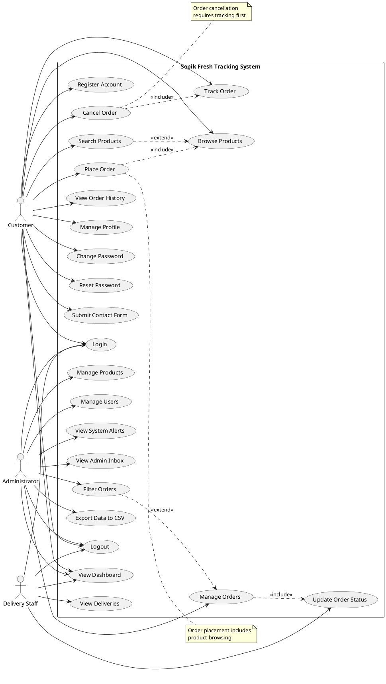
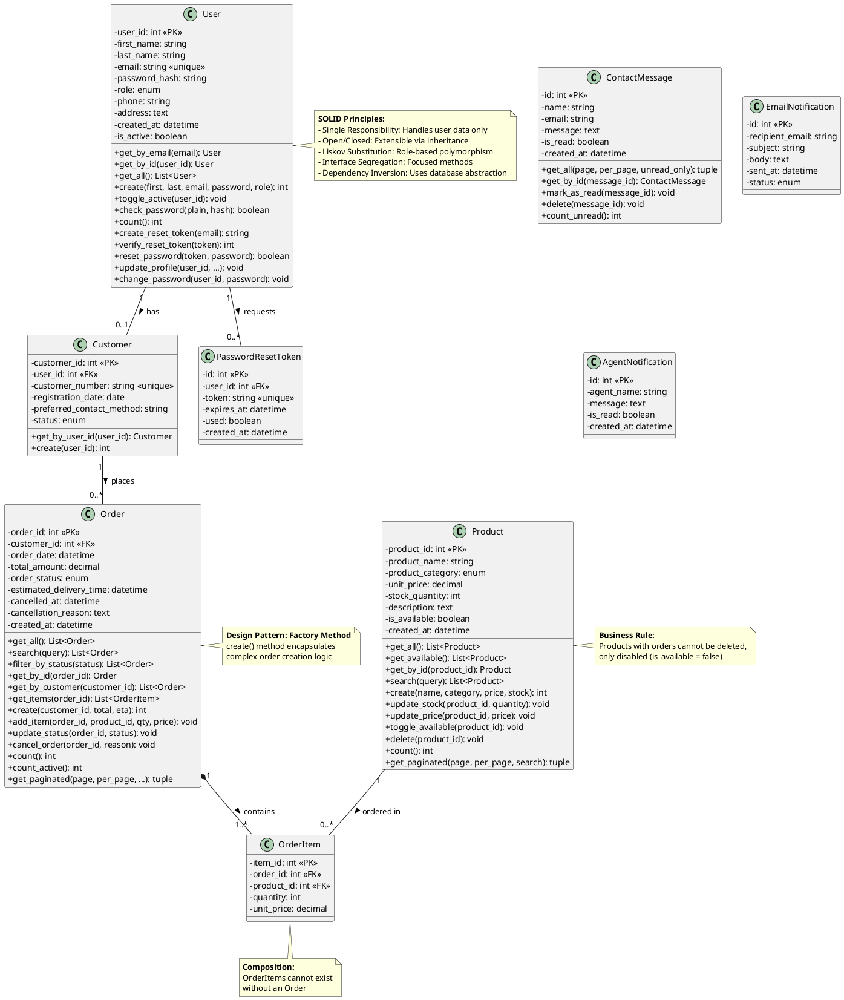
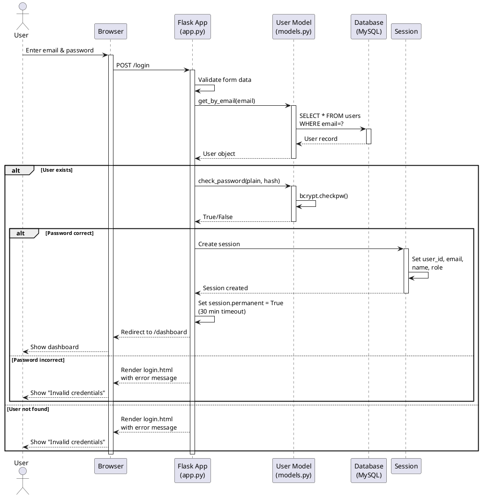
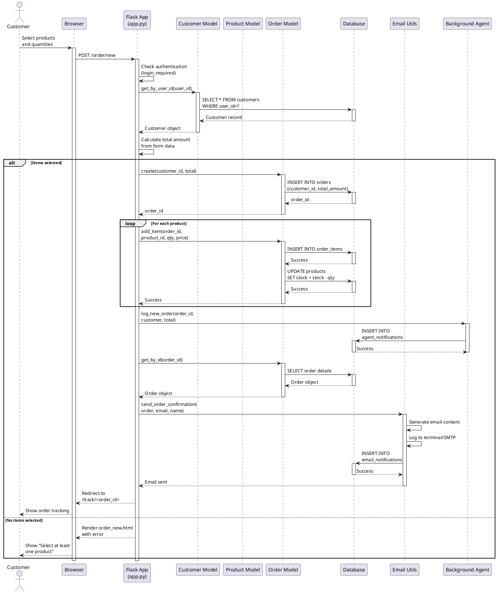

# UML Diagrams
## Sepik Fresh Tracking System

---

## How to Render These Diagrams

**Option 1: Online (Easiest)**
1. Go to http://www.plantuml.com/plantuml/uml/
2. Copy the PlantUML code below
3. Paste and click "Submit"
4. Download as PNG/SVG

**Option 2: VS Code**
1. Install "PlantUML" extension
2. Open this file
3. Press Alt+D to preview
4. Right-click → Export to PNG

**Option 3: draw.io**
1. Go to https://app.diagrams.net/
2. Use the diagrams below as reference
3. Create manually with drag-and-drop

---

## 1. USE CASE DIAGRAM

### PlantUML Code



### Description

**Actors:**
- **Customer** (Primary): End users who order products
- **Administrator** (Primary): System managers with full control
- **Delivery Staff** (Primary): Personnel who deliver orders

**Use Cases (24 total):**
- **Customer Use Cases (13):** Registration, login, browsing, ordering, tracking, cancellation, profile management
- **Admin Use Cases (8):** Product/order/user management, inbox, exports, alerts, filtering
- **Staff Use Cases (2):** View deliveries, update status
- **Shared Use Cases (3):** Login, logout, dashboard

**Relationships:**
- **Include:** Place Order includes Browse Products (must browse to order)
- **Include:** Cancel Order includes Track Order (must track to cancel)
- **Extend:** Search Products extends Browse Products (optional enhancement)
- **Extend:** Filter Orders extends Manage Orders (optional enhancement)

---

## 2. CLASS DIAGRAM

### PlantUML Code



### Description

**Classes (9 total):**
1. **User** - Core user entity with authentication
2. **Customer** - Customer-specific data (extends User relationship)
3. **Product** - Product catalog management
4. **Order** - Order management and tracking
5. **OrderItem** - Individual items within orders (composition)
6. **ContactMessage** - Customer inquiries
7. **PasswordResetToken** - Password reset functionality
8. **EmailNotification** - Email tracking
9. **AgentNotification** - System alerts

**Relationships:**
- **One-to-One:** User → Customer (1:0..1)
- **One-to-Many:** Customer → Order (1:0..*)
- **One-to-Many:** User → PasswordResetToken (1:0..*)
- **One-to-Many:** Product → OrderItem (1:0..*)
- **Composition:** Order ◆→ OrderItem (1:1..*)

**Multiplicity:**
- User can have 0 or 1 Customer profile
- Customer can place 0 or many Orders
- Order must have 1 or more OrderItems
- Product can be in 0 or many OrderItems

**SOLID Principles Demonstrated:**
- **Single Responsibility:** Each class has one clear purpose
- **Open/Closed:** Classes extensible without modification
- **Liskov Substitution:** Role-based user types
- **Interface Segregation:** Focused method interfaces
- **Dependency Inversion:** Database abstraction via _q() helper

---

## 3. SEQUENCE DIAGRAM - Login Workflow

### PlantUML Code



### Description

**Participants:**
- **User:** End user attempting to login
- **Browser:** Client-side interface
- **Flask App:** Application controller (app.py)
- **User Model:** Data access layer (models.py)
- **Database:** MySQL database
- **Session:** Server-side session storage

**Flow:**
1. User enters credentials in browser
2. Browser sends POST request to /login
3. Flask validates form data
4. User Model queries database for user by email
5. If user exists, password is verified with bcrypt
6. If password correct, session is created with user data
7. Session timeout set to 30 minutes
8. User redirected to role-appropriate dashboard
9. If authentication fails, error message displayed

**Key Points:**
- Password never stored in plain text
- Bcrypt verification is one-way (cannot reverse hash)
- Session created only after successful authentication
- Role-based dashboard routing
- Generic error messages (security best practice)

---

## 4. SEQUENCE DIAGRAM - Place Order Workflow

### PlantUML Code



### Description

**Participants:**
- **Customer:** Authenticated user placing order
- **Browser:** Client interface
- **Flask App:** Application controller
- **Customer Model:** Customer data access
- **Product Model:** Product data access
- **Order Model:** Order data access
- **Database:** MySQL database
- **Email Utils:** Email notification system
- **Background Agent:** Monitoring system

**Flow:**
1. Customer selects products and quantities
2. Browser submits order form
3. Flask validates authentication
4. Customer record retrieved from database
5. Total amount calculated from form data
6. Order created in database
7. For each product:
   - Order item added to order_items table
   - Stock quantity decremented
8. Background agent logs new order alert
9. Order details retrieved for email
10. Confirmation email sent to customer
11. Customer redirected to order tracking page

**Key Points:**
- Authentication required (login_required decorator)
- Stock deduction is atomic with order creation
- Background monitoring triggered immediately
- Email notification sent asynchronously
- Transaction safety ensures data consistency
- Error handling for empty orders

---

## 5. ACTIVITY DIAGRAM - Order Processing Workflow

### PlantUML Code

```plantuml
@startuml Sepik_Fresh_Order_Processing_Activity

|Customer|
start
:Browse Products;
:Select Products\nand Quantities;
:Submit Order;

|System|
:Validate Order;

if (Items Selected?) then (yes)
  :Create Order Record;
  :Generate Order ID;
  
  fork
    :Add Order Items;
    :Deduct Stock;
  fork again
    :Log to Agent\nNotifications;
  end fork
  
  :Send Confirmation\nEmail to Customer;
  
  |Customer|
  :Receive Email\nNotification;
  :View Order\nTracking Page;
  
  |Administrator|
  :Review New Order\non Dashboard;
  :Confirm Order;
  
  |System|
  :Update Status\nto "Confirmed";
  :Send Status Update\nEmail;
  
  |Administrator|
  :Assign to\nDelivery Staff;
  :Update Status\nto "Processing";
  
  |System|
  :Send Status Update\nEmail;
  
  |Delivery Staff|
  :View Delivery List;
  :Pick Up Order;
  :Update Status to\n"Out for Delivery";
  
  |System|
  :Send Status Update\nEmail;
  
  |Delivery Staff|
  :Deliver to Customer;
  :Update Status\nto "Delivered";
  
  |System|
  :Send Delivery\nConfirmation Email;
  
  |Customer|
  :Receive Order;
  stop
  
else (no)
  |System|
  :Show Error Message;
  |Customer|
  :Return to\nOrder Form;
  stop
endif

note right of "Create Order Record"
  **Decision Point:**
  Stock availability checked
  before order creation
end note

note right of "Deduct Stock"
  **Business Rule:**
  Stock deduction is atomic
  with order creation
end note

@enduml
```

### Description

**Swimlanes:**
- **Customer:** Places and receives orders
- **System:** Automated processing and notifications
- **Administrator:** Order management and assignment
- **Delivery Staff:** Order fulfillment

**Process Flow:**
1. **Customer Actions:**
   - Browse products
   - Select items and quantities
   - Submit order
   - Receive email notifications
   - View tracking page

2. **System Actions:**
   - Validate order
   - Create order record
   - Deduct stock (atomic operation)
   - Log to monitoring system
   - Send email notifications at each status change

3. **Administrator Actions:**
   - Review new orders on dashboard
   - Confirm orders
   - Assign to delivery staff
   - Update status to "Processing"

4. **Delivery Staff Actions:**
   - View delivery list
   - Pick up orders
   - Update status to "Out for Delivery"
   - Deliver to customer
   - Update status to "Delivered"

**Decision Points:**
- **Items Selected?** - Validates order has at least one item
- **Stock Available?** - Implicit check during stock deduction

**Parallel Activities:**
- Order item creation and stock deduction happen concurrently
- Agent notification logged in parallel with order creation

**Key Business Rules:**
- Stock deduction is atomic with order creation
- Email sent at every status change
- Order cannot proceed without items
- Status progression is linear (no skipping)

---

## 6. ACTIVITY DIAGRAM - Order Cancellation Workflow

### PlantUML Code

```plantuml
@startuml Sepik_Fresh_Order_Cancellation_Activity

|Customer|
start
:Navigate to\nOrder Tracking;
:View Order Details;

if (Order Status?) then (Pending or Confirmed)
  :Click "Cancel Order";
  :Enter Cancellation\nReason (Optional);
  :Confirm Cancellation;
  
  |System|
  :Retrieve Order Items;
  
  fork
    :Restore Stock\nfor Each Item;
  fork again
    :Update Order Status\nto "Cancelled";
  fork again
    :Record Cancellation\nTimestamp;
  fork again
    :Store Cancellation\nReason;
  end fork
  
  :Send Cancellation\nEmail to Customer;
  
  |Customer|
  :Receive Cancellation\nConfirmation;
  :View Updated\nOrder Status;
  stop
  
else (Out for Delivery or Delivered)
  |System|
  :Show Error Message\n"Cannot cancel order";
  |Customer|
  :Return to\nTracking Page;
  stop
endif

note right of "Restore Stock\nfor Each Item"
  **Business Rule:**
  Stock restoration is automatic
  and atomic with cancellation
end note

note right of "Update Order Status\nto "Cancelled""
  **Data Integrity:**
  All cancellation data
  recorded in single transaction
end note

@enduml
```

### Description

**Swimlanes:**
- **Customer:** Initiates cancellation
- **System:** Processes cancellation and restores stock

**Process Flow:**
1. Customer navigates to order tracking
2. System checks order status
3. If status is "Pending" or "Confirmed":
   - Customer can cancel
   - Optional reason provided
   - Confirmation required
4. System processes cancellation:
   - Retrieves all order items
   - Restores stock for each item (parallel)
   - Updates order status to "Cancelled" (parallel)
   - Records cancellation timestamp (parallel)
   - Stores cancellation reason (parallel)
5. Email notification sent to customer
6. Customer sees updated status

**Decision Point:**
- **Order Status Check:** Only pending/confirmed orders can be cancelled

**Parallel Activities:**
- Stock restoration, status update, timestamp, and reason storage happen concurrently

**Key Business Rules:**
- Orders "Out for Delivery" or "Delivered" cannot be cancelled
- Stock automatically restored upon cancellation
- Cancellation reason is optional but recommended
- All cancellation data recorded atomically

---

## Diagram Summary

| Diagram Type | Count | Purpose |
|--------------|-------|---------|
| **Use Case Diagram** | 1 | Shows 24 use cases across 3 actors |
| **Class Diagram** | 1 | Shows 9 classes with relationships and SOLID principles |
| **Sequence Diagrams** | 2 | Login workflow + Place Order workflow |
| **Activity Diagrams** | 2 | Order Processing + Order Cancellation |
| **TOTAL** | **6** | **Complete UML documentation** |

---

## How to Use These Diagrams

### For Documentation Report:
1. Render each diagram using PlantUML
2. Export as PNG (high resolution)
3. Insert into Word/PDF document
4. Add captions and descriptions

### For Presentation:
1. Include Use Case Diagram (overview)
2. Include Class Diagram (OOP design)
3. Include one Sequence Diagram (workflow)
4. Explain key design decisions

### For Code Walkthrough:
1. Reference Class Diagram when showing models.py
2. Reference Sequence Diagram when showing routes
3. Reference Activity Diagram when explaining business logic

---

## Design Decisions Highlighted

### 1. **MVC Architecture**
- **Model:** User, Product, Order, Customer classes (models.py)
- **View:** 21 Jinja2 templates with inheritance
- **Controller:** Flask routes in app.py

### 2. **OOP Principles**
- **Encapsulation:** All database logic in model classes
- **Abstraction:** _q() helper abstracts database operations
- **Inheritance:** Template inheritance for consistent UI
- **Polymorphism:** Role-based dashboard routing

### 3. **SOLID Principles**
- **Single Responsibility:** Each class has one purpose
- **Open/Closed:** Extensible without modification
- **Liskov Substitution:** Role-based user types
- **Interface Segregation:** Focused method interfaces
- **Dependency Inversion:** Database abstraction layer

### 4. **Design Patterns**
- **Factory Method:** Order.create() encapsulates complex creation
- **Repository Pattern:** Model classes act as repositories
- **Decorator Pattern:** login_required() decorator for access control
- **Observer Pattern:** Email notifications on status changes

---

## Conclusion

These UML diagrams provide comprehensive visual documentation of the Sepik Fresh Tracking System's architecture, workflows, and design decisions. They demonstrate:

✅ **Clear system boundaries** (Use Case Diagram)  
✅ **Robust OOP design** (Class Diagram)  
✅ **Well-defined workflows** (Sequence Diagrams)  
✅ **Business process modeling** (Activity Diagrams)  
✅ **SOLID principles** (Class Diagram annotations)  
✅ **Design patterns** (Sequence Diagram implementations)

The diagrams align with the implemented system and support the technical documentation, making them suitable for academic submission and professional presentation.
